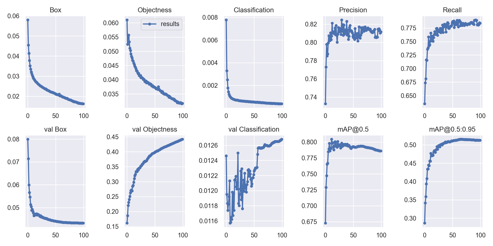
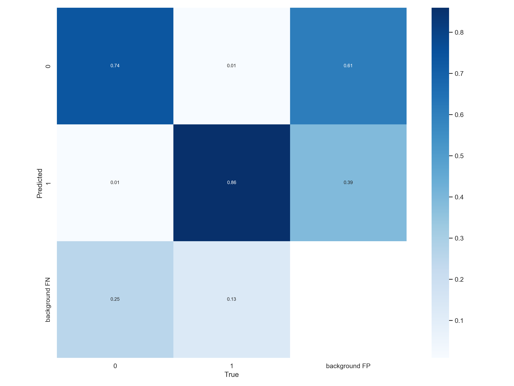
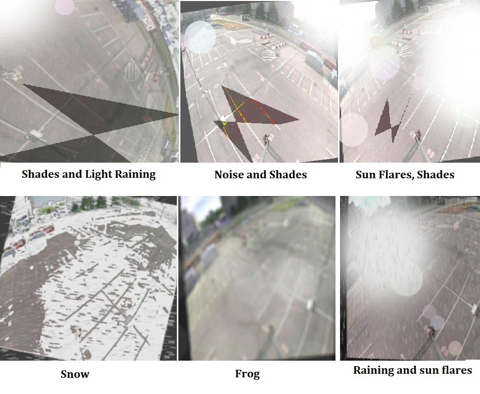

# Parking yolo

In this repo, we will use a park detection dataset.
Here, we will go over some of the important points and the changes that we have made.

The dataset has been downloaded from roboflow [here.](https://universe.roboflow.com/rawdatasetmaison/data_out_raw/dataset/1 "Click here")

## Google Colab File Link (A Single Click Solution)

The google colab file link for yolov7 parking detection is provided below, 
you can check the implementation in Google Colab, and its a single click implementation, 
you just need to select the Run Time as GPU, and click on Run All. It is recommended not to train the model.

[Google colab File](https://drive.google.com/file/d/1KZGEaEaJinB-fAuHuvfBmGSijstD7-cA/view?usp=sharing "Click here")

## Park model with weather augmented image and 100 epochs.

Our team has trained a model with 100 epochs and this is the results. You can [download](https://drive.google.com/u/3/uc?id=1DocweSxBheINGL_yJ1kndiSvLXJFESOU&export=download "Click here")
 it here

Also the confusion matrix has been plotted.

We thought that weather augmented images would be interested. Here, we have some examples.

You can see all the models in details on this [link](https://drive.google.com/drive/folders/1B5TfZbSYyXbXuIABJ_b_iSdjdUPWF-Kc?usp=share_link "Click here")

